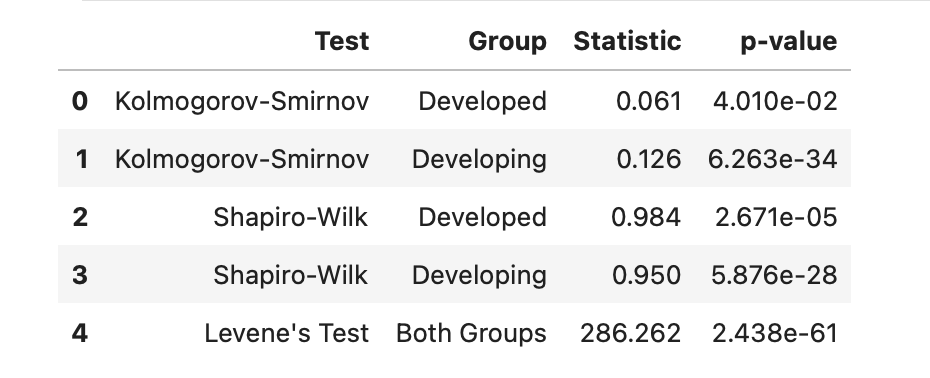
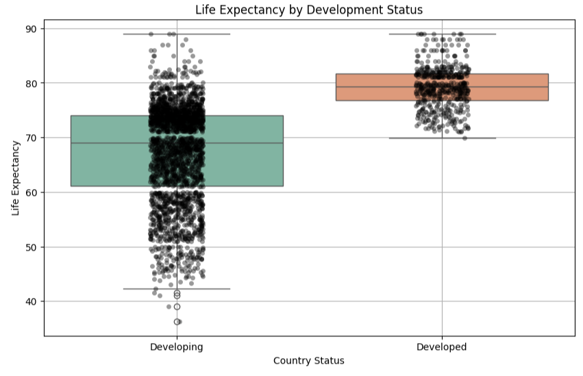

# Life Expectancy Analysis

This project investigates whether there is a statistically significant difference in life expectancy between developed and developing countries using SQL and Python. The dataset provides country-level averages across a range of health-related variables collected between 2000 and 2015.

## Dataset
- **Source**: [World Health Organization via Kaggle](https://www.kaggle.com/datasets/kumarajarshi/life-expectancy-who)
- **Name**: Life Expectancy Data
- **Time Range**: 2000–2015
- **Format**: CSV
- **Fields**: Country, Status (Developed/Developing), Year, Life Expectancy, and various health indicators

## Tools Used

- SQL via DuckDB (embedded in Python)
- pandas for data wrangling
- seaborn and matplotlib for visualization
- scipy.stats for statistical tests

## Method Summary

1. Queried and selected variables of interest using DuckDB SQL
2. Generated descriptive statistics grouped by development status
3. Visualized distributions with histograms and boxplots
4. Checked assumptions of normality (Kolmogorov–Smirnov, Shapiro–Wilk)
5. Tested equality of variances (Levene's test)
6. Conducted Mann–Whitney U test due to non-normality
7. Calculated rank-biserial correlation as effect size

  

## Results

- **Normality**: Both groups failed normality tests
- **Levene’s Test**: Suggests unequal variances
- **Mann–Whitney U Test**: Statistically significant difference (p < .001)
- **Effect Size**: Rank-biserial correlation ≈ 0.83 (large effect)

## Conclusion

Life expectancy is significantly higher in developed countries, with a strong effect size. This supports the hypothesis that development status is a key factor in public health outcomes. If you're wondering why there's not more overlap in life expectancy between developed and developing countries, it's important to note that this analysis focuses on group averages. While there may be individual variation, the aggregated data highlights a clear systemic difference in outcomes.
